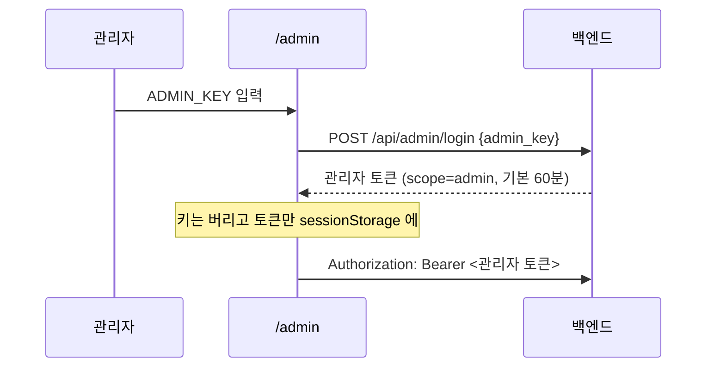

# 관리자 화면

← [그룹 가계부](README.md) · 관련 [인증과 그룹 격리](auth-and-scoping.md) [개발 환경 세팅](setup.md)

`/admin` 에서 **그룹·구성원·초대 코드**를 다룬다. 예전에는 `curl` 로 `X-Admin-Key` 를 붙여
API 를 직접 부르는 수밖에 없었다 → [#33](https://github.com/s2ngK/claude-asset-man/issues/33)

# 관리자 키를 브라우저에 두지 않는다

`ADMIN_KEY` 는 **모든 그룹을 만들고 볼 수 있는 값**이다. 그걸 `localStorage` 에 넣어두면
XSS 한 번에 통째로 샌다. 그래서 키는 한 번만 보내고 토큰으로 바꾼다.

| | 사용자 토큰 | 관리자 토큰 |
|---|---|---|
| 클레임 | `sub`, `group_id` | `scope: "admin"` (`sub` 없음) |
| 수명 | `TOKEN_EXPIRE_DAYS` (기본 30일) | `ADMIN_TOKEN_EXPIRE_MINUTES` (기본 60분) |
| 저장소 | `localStorage` + 쿠키 | `sessionStorage` — 탭을 닫으면 사라진다 |

> [!IMPORTANT] 두 토큰은 서로의 자리에서 거부된다
> 같은 시크릿으로 서명하지만 **`scope` 로 갈린다.**
> `get_current_user` 는 `scope == "admin"` 이면 401 을 주고, `check_admin_auth` 는
> `scope` 가 `admin` 이 아니면 통과시키지 않는다. 관리자 권한이 사용자 API 로
> 흘러들어가는 경로를 만들지 않는다.

`X-Admin-Key` 헤더도 **여전히 받는다.** 스크립트·`curl` 은 토큰을 받아올 이유가 없다.
키 비교는 `secrets.compare_digest` 로 한다.

# 화면이 하는 일

| 하는 일 | 엔드포인트 |
|---|---|
| 그룹 목록·생성 | `GET`/`POST /api/admin/groups` |
| 구성원 목록·생성 | `GET`/`POST /api/admin/users` |
| 초대 코드 재발급 | `POST /api/admin/users/{id}/invite-code` |

구성원 생성 시 초대 코드를 비우면 **서버가 만들어 준다**(`secrets.token_urlsafe(8)`).
사람이 고른 코드보다 그쪽이 낫다.

## 초대 코드는 가려서 보여준다

초대 코드가 곧 로그인 자격증명이다 (→ [인증과 그룹 격리](auth-and-scoping.md)).
목록에서는 `•••••••••••` 로 가리고, [보기] 를 눌러야 드러난다. [복사] 는 화면에 띄우지 않고
클립보드로만 보낸다 — 클립보드가 막힌 환경에서는 어쩔 수 없이 드러낸다.

## 재발급하면 예전 코드는 즉시 죽는다

`invite_code` 를 새 값으로 덮어쓴다. 유출됐을 때 **사용자를 새로 만드는 것 말고는 돌릴
방법이 없던 문제**가 이걸로 해결된다.

> [!WARNING] 이미 발급된 JWT 는 살아 있다
> 코드를 바꿔도 그 코드로 이미 로그인한 세션은 만료까지 유효하다. 토큰 폐기 목록이
> 없기 때문이다 (→ [인증과 그룹 격리](auth-and-scoping.md)). 유출이 확실하면
> `JWT_SECRET` 을 갈아야 **모든** 세션이 끊긴다.

# 라우팅

`/admin` 은 `proxy.ts` 에서 **사용자 로그인 검사를 건너뛴다.** 관리자는 가계부 사용자가
아니어도 되고, 관리자 토큰은 `sessionStorage` 에 있어 proxy 가 볼 수도 없다. 화면이 직접
자기 인증을 한다.

토큰이 없거나 죽었으면 화면이 인증 폼으로 돌아간다 — `adminRequest` 가 401·403 을 받으면
토큰을 지우고 `AdminAuthError` 를 던진다.

# 아직 없는 것

- **그룹·구성원 삭제.** 거래가 딸린 사용자를 지우면 그 기록이 어떻게 되는지부터 정해야 한다
- **그룹별 관리자.** 지금은 `ADMIN_KEY` 하나가 전체 권한이다. 그룹 소유자 개념이 없다
- `GET /api/admin/users` 는 여전히 **모든 그룹의 초대 코드를 평문으로** 돌려준다.
  화면이 가려서 보여줄 뿐 응답 자체는 그대로다
