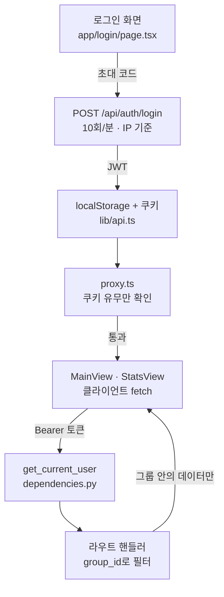

# 아키텍처 개요

← [그룹 가계부](README.md)

전체를 이해하는 가장 빠른 길은 요청 하나가 어디를 거치는지 따라가는 것이다.

# 요청이 흐르는 길



# 세 가지만 기억하면 된다

## 1. `proxy.ts`는 인증하지 않는다
- 쿠키가 **있는지만** 본다. 토큰이 위조됐든 만료됐든 화면은 열린다
- 진짜 검증은 백엔드 `get_current_user`에서만 일어난다
- 즉 프론트의 라우팅 가드는 UX 장치일 뿐 보안 경계가 아니다
- Next 16에서 `middleware` 파일 컨벤션이 `proxy`로 이름이 바뀌었다 → [함정과 교훈](pitfalls.md)

## 2. 토큰이 두 군데 저장된다
- `localStorage` — API 호출 시 `Authorization: Bearer`에 실린다
- 쿠키 — `proxy.ts`가 읽기 위한 용도. `document.cookie`로 심으므로 **HttpOnly가 아니다**
- 둘은 **별개로 만료된다**. 자세한 건 [인증과 그룹 격리](auth-and-scoping.md)

## 3. 그룹 격리는 관례다
- 외래키는 있지만 "이 데이터가 내 그룹 것인가"를 강제하는 DB 제약은 없다
- 모든 쿼리가 `current_user.group_id`로 필터링되는 것에 의존한다
- **새 엔드포인트에서 이 필터를 빠뜨리면 그대로 데이터가 샌다**

# 레이어 구성

## 백엔드 (`backend/app/`)
- `main.py` — 앱 조립. 라우터 등록, CORS, rate limit 미들웨어, 시작 시 설정 검증 + 시딩
- `config.py` — 환경변수를 **함수로** 읽는다(모듈 상수로 굳히면 테스트가 못 바꾼다) + `verify_startup_config()`
- `database.py` — 엔진 + `SessionLocal` + `get_db` 의존성
- `models.py` — SQLAlchemy ORM. [데이터 모델](data-model.md)
- `schemas.py` — Pydantic 입출력 스키마
- `dependencies.py` — 사용자 인증(`get_current_user`)과 관리자 신원(`resolve_admin`). [인증과 그룹 격리](auth-and-scoping.md)
- `queries.py` — 여러 라우트가 함께 쓰는 필터(`visible_categories`)와 `기타` 이동
- `palette.py` — 검증기를 통과한 범주형 색 8개. 카테고리 색의 **유일한 출처**. [통계 집계 규칙](stats-rules.md)
- `rate_limit.py` — slowapi limiter. [함정과 교훈](pitfalls.md)
- `routes/` — `auth` `transactions` `categories` `stats` `admin`
- `seed.py` — 시스템 기본 카테고리 10개

스키마는 **Alembic이 관리한다.** `create_all()`을 쓰지 않는다. 모델을 고치면 반드시:
```
uv run alembic revision --autogenerate -m "..."
```
생성된 마이그레이션은 눈으로 검토하고 커밋한다.

## 웹 (`src/`)
- `proxy.ts` — 쿠키 기반 라우팅 가드 (구 `middleware.ts`)
- `lib/api.ts` — **백엔드와 대화하는 유일한 통로.** 토큰 관리도 여기
- `lib/adminApi.ts` — `/admin` 화면 전용. 관리자 토큰은 `sessionStorage` 에 따로 둔다. [관리자 화면](admin-console.md)
- `lib/constants.ts` — `DEFAULT_CATEGORIES` · `CHART_COLORS`(`palette.py` 와 같은 값) · 요일 표기
- `lib/useLocalUser.ts`, `lib/useAdminToken.ts` — `useSyncExternalStore` 로 스토리지를 읽는다. 효과에서 `setState` 하지 않는 이유는 [함정과 교훈](pitfalls.md)
- `types/index.ts` — UI가 쓰는 타입
- `components/` — 목록 `MainView` `TransactionItem` `UndoToast` · 입력 `AddEntryModal` `DatePicker` ·
  통계 `StatsView` `MonthCalendar` · 공통 `AppNav` `MonthPicker` · 설정 `SettingsView`
- `app/` — App Router. `/` `/login` `/stats` `/settings` `/admin`

`/admin` 은 나머지와 **인증 체계가 다르다.** 초대 코드가 아니라 관리자 키로 로그인하고,
토큰도 `sessionStorage` 에 따로 산다 → [관리자 화면](admin-console.md)

화면은 전부 클라이언트 컴포넌트다. 서버 컴포넌트에서 데이터를 가져오지 않는다 — 토큰이 `localStorage`에 있기 때문이다.

# 건드릴 필요 없는 곳
- `references/design/` — Vite 프로토타입. UI 참고용이고 빌드에 안 들어간다. lint 대상에서도 제외
- `supabase/` — 마이그레이션 전 잔재. 죽은 코드
- `public/sw.js`, `workbox-*.js` — next-pwa가 빌드 때 생성. git 추적 대상 아님
