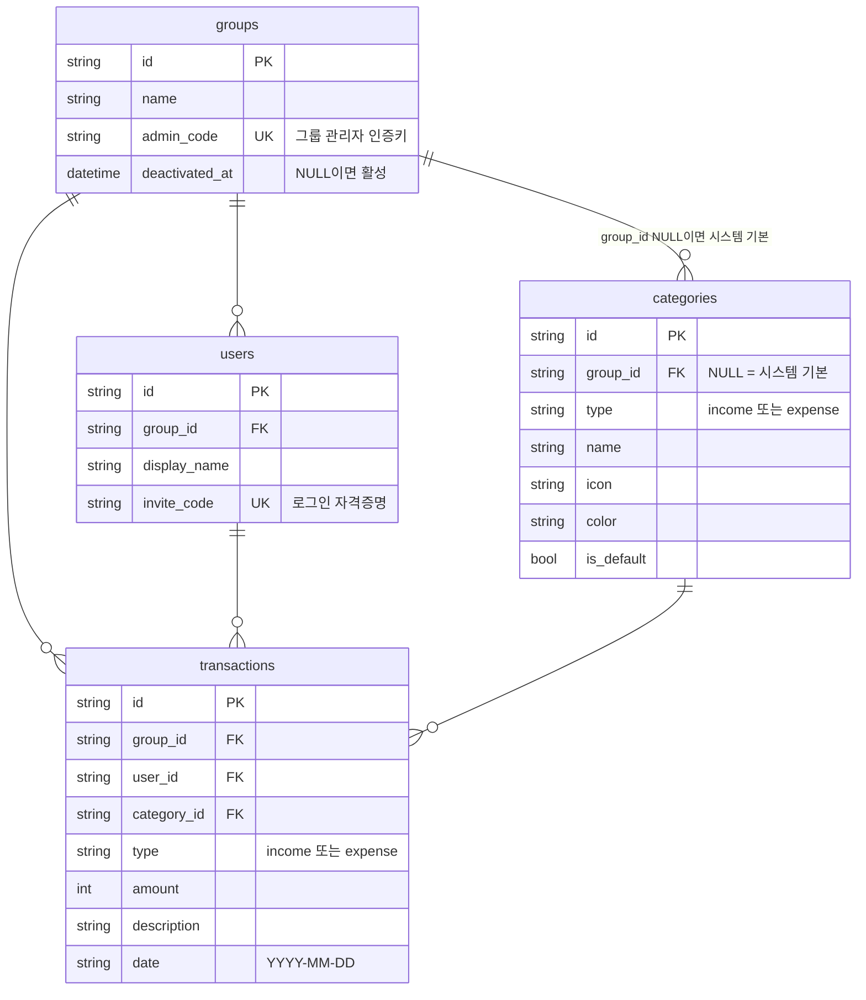

# 데이터 모델

← [그룹 가계부](README.md) · 관련 [아키텍처 개요](architecture.md) [인증과 그룹 격리](auth-and-scoping.md)

테이블 4개가 전부다. `backend/app/models.py` 80줄이면 다 읽는다.

# 알아둘 규칙

## 모든 PK는 문자열 UUID
- `default=gen_uuid`로 파이썬 쪽에서 생성한다. DB의 autoincrement를 쓰지 않는다
- 덕분에 SQLite → 다른 DB로 옮길 때 걸리는 게 적다

## `categories.group_id IS NULL` = 시스템 기본값
- 시작 시 `seed.py`가 10개를 심는다. **이미 카테고리가 하나라도 있으면 시딩을 건너뛴다**
- 조회 시 `group_id IS NULL OR group_id = 내 그룹`으로 필터한다 (`routes/categories.py`)
- 그룹 전용 카테고리를 만드는 기능은 **아직 없다.** API에 카테고리 생성 엔드포인트가 없다
- 이 기능을 추가할 때 반드시 [결함 목록](known-issues.md)의 [#5](https://github.com/s2ngK/claude-asset-man/issues/5)을 먼저 고쳐야 한다

## 시스템 기본 카테고리 10개
`backend/app/seed.py` 기준.

| type | name |
|---|---|
| expense | 식비 · 교통 · 쇼핑 · 주거/통신 · 의료/건강 · 기타 |
| income | 급여 · 용돈 · 금융수입 · 기타 |

**`기타`가 expense와 income 양쪽에 있다.** 이름만으로는 구분되지 않으므로 항상 `name + type`으로 찾아야 한다 → [거래 등록 흐름](flow-create-transaction.md)

## `date`를 `String`으로 저장한다
의도된 선택이다.

- ISO `YYYY-MM-DD`는 **사전순 정렬이 곧 날짜순**이라 `ORDER BY date`가 그대로 동작한다
- 월 필터가 `date.startswith("2026-08")` 한 줄로 끝난다
- DB 레벨 제약은 여전히 없지만, **API 경계에서 Pydantic이 막는다** — 입력을 `date`로 받아 검증하고 저장 직전 ISO 문자열로 되돌린다 (`routes/transactions.py`의 `_storable`) · [결함 목록](known-issues.md)

## `type`은 DB에선 그냥 `String`이다
- 컬럼에는 CHECK 제약도 Enum도 없다
- 대신 **Pydantic이 `Literal["income", "expense"]`로 막는다** (`schemas.TransactionType`)
- API를 거치지 않고 DB에 직접 쓰면 여전히 아무 값이나 들어간다. 그런 행은 [통계에서 증발한다](stats-rules.md)

## 그룹이 하나뿐인데 `group_id`를 유지한다
다중 그룹으로 확장할 때 스키마 변경 없이 열리도록 처음부터 넣어둔 것이다. 이건 "미래를 위한 빈 자리"가 아니라 **지금도 실제로 격리에 쓰이는 컬럼**이다.

## 없는 것
- `updated_at` — 수정 이력을 추적하지 않는다
- 소프트 삭제 — DELETE는 실제 삭제다
- `image_url` — `src/types/index.ts`에 필드가 남아 있지만 Supabase 시절 잔재고 DB에도 API에도 없다

# 그룹은 지우지 않는다

`groups.deactivated_at` 이 NULL 이 아니면 **비활성 그룹**이다. 행도, 거래도, 카테고리도
그대로 둔다 — 복구할 수 있어야 하기 때문이다.

비활성화하면 그 그룹의 **인증키가 전부 새로 발급된다** (구성원 `invite_code` + 그룹
`admin_code`). 복구해도 옛 코드는 살아나지 않는다 → [관리자 화면](admin-console.md)

`admin_code` 는 유니크 인덱스(`ix_groups_admin_code`)로 강제한다. 이 값 하나가 곧 그
그룹의 관리 권한이라 겹치면 안 된다. SQLite 유니크 인덱스는 NULL 을 여럿 허용하므로
값이 없는 그룹이 생길 수 있다 — 그룹 생성 시 항상 함께 발급해 그 상태를 만들지 않는다.
