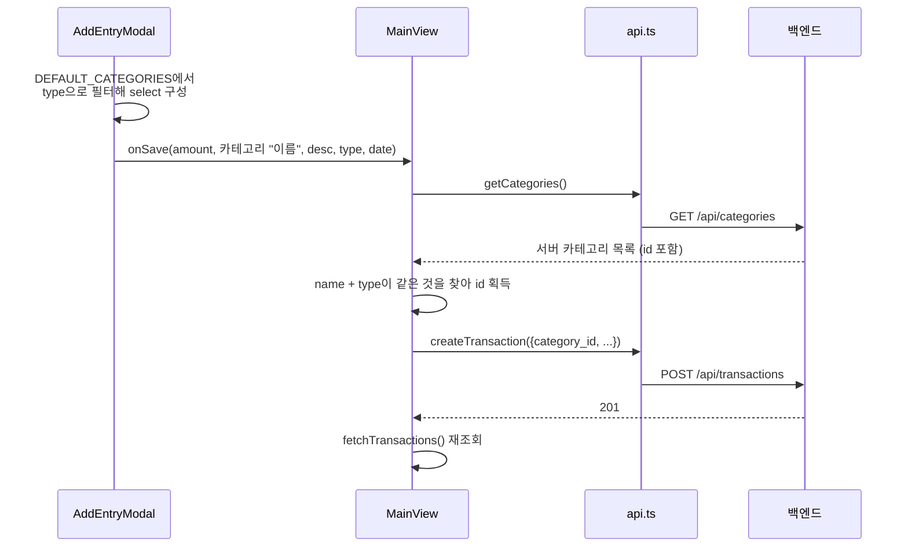

# 거래 등록 흐름

← [그룹 가계부](README.md) · 관련 [엔드포인트별 규칙](api-rules.md) [데이터 모델](data-model.md)

거래 하나가 저장될 때까지의 경로. **이름 기반 카테고리 매칭**이라는 함정이 여기 있다.

# 흐름

# 핵심: 모달은 이름만 넘긴다

`AddEntryModal`은 `category_id`를 모른다. `src/lib/constants.ts`의 `DEFAULT_CATEGORIES`로 select를 그리기 때문에 **로컬 상수의 이름 문자열**만 갖고 있다.

그래서 `MainView.handleSaveEntry`가 저장할 때마다:
1. `getCategories()`로 **서버 카테고리를 매번 새로 받아온다**
2. `name`과 `type`이 모두 일치하는 것을 찾는다
3. 못 찾으면 `name`만으로 한 번 더 찾는다 (fallback)
4. 그래도 없으면 에러

> [!WARNING] 두 파일이 조용히 결합돼 있다
> `src/lib/constants.ts`의 `DEFAULT_CATEGORIES`와 `backend/app/seed.py`의 시딩 목록이
> **이름·타입이 정확히 일치해야만** 저장이 된다. 한쪽만 고치면 즉시 깨진다.
> 코드 어디에도 이 결합을 강제하는 장치가 없다.

## 실제로 터졌던 사례
프론트 `DEFAULT_CATEGORIES`에 `type` 필드 자체가 없던 시기가 있었다. 그래서
`DEFAULT_CATEGORIES.filter(c => c.type === type)`가 **항상 빈 배열**을 반환했고,
거래 추가 모달의 카테고리 select가 통째로 비어 있었다. 타입 에러로도 잡혔지만
`npm run build`가 애초에 깨져 있어서 한동안 아무도 몰랐다.

지금은 `type`이 들어갔고 양쪽 10개가 일치하는 것을 실제 서버로 확인했다.

## 왜 `기타`가 두 개인가
시스템 카테고리에 `기타`가 **expense와 income 양쪽에** 있다 → [데이터 모델](data-model.md)

그래서 이름만으로 찾으면 안 되고 반드시 `name + type`이어야 한다. 3번의 fallback(이름만으로 재검색)은 이 경우 잘못된 것을 집을 수 있다.

# 서버 쪽에서 일어나는 일

`POST /api/transactions`:
- `group_id`, `user_id`는 **JWT에서 채운다.** 본문에 넣어도 무시된다
- 카테고리 존재 확인 → 없으면 404
- 저장 후 `joinedload`로 카테고리·사용자를 붙여 평평한 응답을 만든다

검증되는 것:
- **카테고리 소유권** — `visible_categories()` 를 통과해야 한다. 시스템 기본값이거나 자기 그룹 전용이어야 하며, 아니면 404 ([#5](https://github.com/s2ngK/claude-asset-man/issues/5))
- **`type`·`amount`·`date` 값** — Pydantic 스키마에서 막는다 ([#6](https://github.com/s2ngK/claude-asset-man/issues/6))

# 저장 후

`await fetchTransactions()`로 **목록을 통째로 다시 받아온다.**

- 낙관적 업데이트를 하지 않는다 (삭제와는 반대 → [삭제와 되돌리기](flow-delete-undo.md))
- 그래서 저장이 느리게 느껴질 수 있지만 화면과 서버가 어긋나지 않는다
- 실패하면 `alert()`로 메시지를 띄운다

# 개선한다면

1. **모달이 `category_id`를 넘기게 한다.** 화면 진입 시 `getCategories()`를 한 번만 호출해 재사용하면
   - 저장할 때마다 나가는 추가 요청이 사라지고
   - `constants.ts` ↔ `seed.py` 결합이 끊어진다
2. `DEFAULT_CATEGORIES`는 서버 응답이 오기 전 **초기 렌더용 폴백**으로만 남긴다

→ [#17](https://github.com/s2ngK/claude-asset-man/issues/17) · [결함 목록](known-issues.md)
