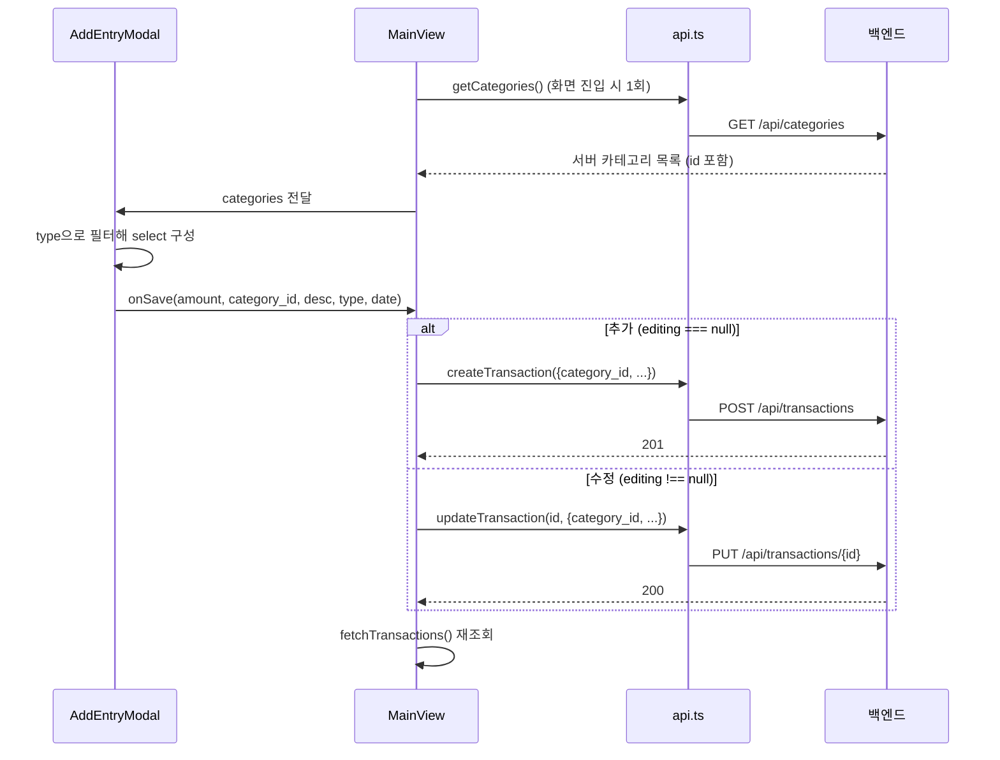

# 거래 등록·수정 흐름

← [그룹 가계부](README.md) · 관련 [목록 정렬과 필터](flow-list-sort-filter.md) [엔드포인트별 규칙](api-rules.md) [데이터 모델](data-model.md)

거래 하나가 저장될 때까지의 경로. 카테고리는 **id 로** 오간다.
추가와 수정은 **같은 모달·같은 경로**를 쓴다.

# 흐름



`getCategories()` 는 `MainView` 가 **마운트 때 한 번** 받아 state 에 들고, 그대로 모달에
넘긴다. 저장할 때 나가는 추가 요청은 없다.

# 추가와 수정은 같은 모달이다

`AddEntryModal` 에 `initial` 을 주면 **수정 모드**가 된다. 폼이 그 값으로 채워지고 제목이
"내역 수정" 으로 바뀐다. 모달은 그 이상을 모른다 — **만들기냐 고치기냐의 판단은 `MainView`**
가 `editing` 상태로 한다. 모달은 값만 모아 `onSave` 로 돌려준다.

목록에서 항목을 **그냥 누르면**(드래그 아님) 수정이 열린다. 단 **자기가 쓴 것만** 열린다 —
남의 내역은 `onEdit` 을 아예 넘기지 않는다. 서버가 403 을 주므로
(→ [인증과 그룹 격리](auth-and-scoping.md)) 열어봐야 저장에서 막힌다.

> [!NOTE]
> 수정해도 `created_at` 은 그대로다. 서버가 그 컬럼을 건드리지 않는다.
> 목록 정렬이 `created_at` 을 쓰므로(→ [목록 정렬과 필터](flow-list-sort-filter.md))
> **금액만 고친 항목이 맨 위로 튀어오르지 않는다.**

## 금액을 비우면 원래 값이 placeholder 로 남는다

수정 중에 `C` 나 백스페이스로 금액을 다 지우면 화면이 `0` 이 되지 않는다. **원래 금액이
흐리게 남고** "비워두면 원래 금액이 그대로 저장됩니다" 라고 알려준다. 그대로 저장하면
원래 값이 유지된다.

`0` 으로 두는 선택지는 애초에 없다 — 서버 스키마가 `amount = Field(gt=0)` 이라 0 은 422 다.
그래서 금액이 0 인 동안에는 **[완료] 를 비활성으로** 둔다. 눌렀다가 알 수 없는 에러를 보는
것보다 낫다.

# 키패드

계산기 배치를 따른다. 숫자는 전화기가 아니라 **계산기 순서**(아래로 갈수록 작아짐)로 놓고,
오른쪽 열은 위에서부터 **지우기 → 연산자 → 확정**으로 내려간다.

```
7   8   9   ⌫
4   5   6   +
1   2   3   −
0   00  C   완료
```

## +/- 는 계산기다

영수증 두 장을 합치거나 더치페이를 나눌 때 쓰라고 둔 것이다.

- `+` / `-` 를 누르면 지금까지의 값이 **확정되고**(`pending`) 키패드는 다음 피연산자를 받는다
- 진행 중인 식은 금액 위에 작게 뜬다 — `12,000 +` → `12,000 + 3,500`
- 큰 숫자는 항상 **지금 저장될 값**이다 (`12,000 + 3,500` 이면 `15,500원`)
- 연속으로 이어진다 — `15,500 - 500` 처럼 앞 결과를 물고 간다
- **[완료] 는 남은 계산을 자동으로 정산한다.** `=` 를 따로 누르지 않아도 된다
- `C` 는 진행 중인 식까지 통째로 지운다 (백스페이스는 현재 피연산자만)
- 수정 모드의 placeholder 상태에서 `+` 를 누르면 **원래 금액에서 시작한다.** 0 에서
  시작하면 쓸모가 없다

### × ÷ 는 왜 없는가

칸이 없어서만은 아니다. 이건 **왼쪽에서 오른쪽으로 그때그때 접는 계산기**라 연산자 우선순위가
없다. `+` 와 `×` 가 섞이면 `12,000 + 3 × 4,500` 을 사람은 `25,500` 으로 읽는데 이 계산기는
`67,500` 을 낸다 — 틀린 값을 조용히 저장하게 된다. 우선순위를 넣으려면 식 전체를 들고 있다가
파싱해야 하고, 그건 가계부 입력창이 감당할 물건이 아니다.

곱셈이 정말 필요해지면 그때는 **키 하나를 더 끼워 넣는 게 아니라** 우선순위까지 갖춘 입력기를
따로 만드는 쪽이 맞다.

> [!NOTE]
> 예전에는 `+`/`-` 가 **아무 동작도 안 하는 것처럼 보였지만 실제로는 입력 문자열에
> 그대로 섞여 들어갔다.** `handleKeyPress` 가 숫자와 같은 분기로 떨어져 `'12000' + '+'`
> 가 됐고, 표시할 때 숫자만 걸러내서 눈에 안 띄었을 뿐이다. 이어서 숫자를 누르면
> `'12000+5'` 가 되어 `120005` 로 읽혔다.

## 종류를 바꾸면 카테고리도 따라간다

카테고리 select 는 `type` 으로 갈린다. 지출에서 `식비` 를 고른 채 수입으로 바꾸면 `식비` 는
새 목록에 없다 — `<select>` 는 첫 항목(`급여`)을 **보여주지만** state 는 `식비` 를 들고 있다.
그대로 저장하면 화면과 다른 카테고리가 붙는다. 그래서 종류를 바꿀 때 현재 선택이 새 목록에
없으면 첫 항목으로 맞춘다.

# 모달은 `category_id` 를 넘긴다

`AddEntryModal` 은 **서버 카테고리 목록을 그대로 받아** select 를 그리고, 고른 것의 `id` 를
`onSave` 로 돌려준다. `MainView` 는 그 값을 그대로 payload 에 넣는다 — 찾아볼 것이 없다.

> [!NOTE] 예전에는 이름으로 찾았다
> 모달이 `src/lib/constants.ts` 의 `DEFAULT_CATEGORIES` 로 select 를 그렸기 때문에
> **이름 문자열**만 갖고 있었고, 저장할 때마다 서버 목록에서 `name + type` 이 같은 것을
> 찾아 id 를 얻었다. 그래서 `constants.ts` 와 `backend/app/seed.py` 의 이름·타입이
> **정확히 일치해야만** 저장이 됐고, 그 결합을 강제하는 장치는 코드 어디에도 없었다.
> 실제로 프론트 `DEFAULT_CATEGORIES` 에 `type` 이 없어 카테고리 select 가 통째로 비었던
> 적이 있다 → [#17](https://github.com/s2ngK/claude-asset-man/issues/17)

## 목록이 오기 전에는 저장할 수 없다

`DEFAULT_CATEGORIES` 의 id 는 `food`, `salary` 같은 **로컬 문자열이라 서버 id 가 아니다.**
그대로 보내면 404 다. 그래서 서버 목록이 비어 있는 동안에는 select 를 비활성으로 두고
[완료] 도 막는다. `DEFAULT_CATEGORIES` 는 그 사이 이름을 보여주는 용도로만 남는다.

## 기본 선택은 이름을 힌트로만 쓴다

서버 목록은 이름순이라 그대로 첫 항목을 쓰면 지출 기본값이 `교통` 이 된다. 예전 기본값
(지출 `식비`, 수입 `급여`)을 유지하려고 `DEFAULT_CATEGORIES` 의 첫 항목 **이름**을 찾아
쓰고, 못 찾으면 목록의 첫 항목으로 떨어진다. 못 찾아도 저장은 정상이므로 이건
결합이 아니라 취향이다.

## 종류를 바꾸면 카테고리도 따라간다

카테고리 목록은 `type` 으로 갈린다. 지출에서 `식비` 를 고른 채 수입으로 바꾸면 `식비` 는
새 목록에 없다. **state 를 고쳐 맞추는 대신 읽을 때 파생시킨다** — 고른 값이 현재 목록에
없으면 기본값으로 읽는다. 그러면 화면과 state 가 어긋나는 순간 자체가 없다.

> [!WARNING] `기타` 는 수입·지출 양쪽에 있다
> 그래서 이름으로 고르면 안 된다 → [데이터 모델](data-model.md). id 로 넘기는 지금은
> 이 문제가 사라졌다.

# 서버 쪽에서 일어나는 일

`POST /api/transactions`:
- `group_id`, `user_id`는 **JWT에서 채운다.** 본문에 넣어도 무시된다
- 카테고리 존재 확인 → 없으면 404
- 저장 후 `joinedload`로 카테고리·사용자를 붙여 평평한 응답을 만든다

검증되는 것:
- **카테고리 소유권** — `visible_categories()` 를 통과해야 한다. 시스템 기본값이거나 자기 그룹 전용이어야 하며, 아니면 404 ([#5](https://github.com/s2ngK/claude-asset-man/issues/5))
- **`type`·`amount`·`date` 값** — Pydantic 스키마에서 막는다 ([#6](https://github.com/s2ngK/claude-asset-man/issues/6))

# 저장 후

`await fetchTransactions()`로 **목록을 통째로 다시 받아온다.**

- 낙관적 업데이트를 하지 않는다 (삭제와는 반대 → [삭제와 되돌리기](flow-delete-undo.md))
- 그래서 저장이 느리게 느껴질 수 있지만 화면과 서버가 어긋나지 않는다
- 실패하면 `alert()`로 메시지를 띄운다

# 그룹 전용 카테고리

시스템 기본 10개 말고, 그룹이 자기 카테고리를 추가해 쓸 수 있다.

| | 누가 | 무엇을 |
|---|---|---|
| `POST /api/categories` | **그룹 관리자만** | 이름·아이콘. 색은 못 고른다 |
| `DELETE /api/categories/{id}` | **그룹 관리자만** | 자기 그룹 것만. 공통 카테고리는 404 |
| `POST`/`DELETE /api/admin/categories` | **전체 관리자만** | 공통 카테고리 (→ [관리자 화면](admin-console.md)) |

카테고리는 그룹이 **함께 쓰는 것**이라 아무나 지우면 남의 거래 분류가 바뀐다. 그래서
최초 초대 사용자 한 명(→ [관리자 화면](admin-console.md))으로 제한한다. 화면
(`SettingsView`)은 `GET /api/auth/me` 의 `is_group_admin` 으로 관리 영역을 보여줄지 정하고,
**권한 판단 자체는 서버가 다시 한다.**

## 색은 서버가 배정한다

사용자가 고르는 것은 이름과 아이콘이다. 색은 `app/palette.py` 의 검증된 목록에서
**아직 안 쓴 것 중 앞의 것**으로 정해진다.

자유 색상 선택을 열면 명도·채도·대비 검증이 통째로 무너진다 — 사람은 "선명해 보이는 색" 을
고르지 "차트에서 읽히는 색" 을 고르지 않는다. 예전 팔레트가 그렇게 생긴 값이었고 흰 카드
위에서 대비가 1.2:1 이었다 (→ [통계 집계 규칙](stats-rules.md)).

8개를 다 쓰면 처음부터 다시 쓴다. 9번째부터 색이 겹치지만 이름·아이콘이 항상 함께 나오므로
못 읽게 되지는 않는다.

## 지우면 거래는 `기타` 로 옮겨간다

거래를 함께 지우지 않는다. 삭제를 거절하지도 않는다.

적요(`description`)가 남아 있어서 **무엇이었는지는 알 수 있다** — 잃는 것은 분류뿐이다.
`기타` 는 수입·지출 양쪽에 하나씩 있으므로 **같은 `type` 의 것**으로 옮긴다.

> [!NOTE] 되돌릴 수는 없다
> 카테고리를 다시 만들어도 옮겨간 거래가 따라오지 않는다. 화면이 삭제를 두 번 눌러야
> 실행되게 한 이유다.

# 남은 결합

`DEFAULT_CATEGORIES`(프론트 상수)는 이제 **저장 경로에 없다.** 남은 쓰임은 두 가지뿐이다.

- 서버 목록이 오기 전 select 에 이름을 채우는 것
- `TransactionItem` 이 아이콘·색을 못 받았을 때의 폴백

둘 다 틀려도 저장은 되고 데이터도 안 어긋난다. `seed.py` 와 이름이 달라지면 잠깐 어색한
이름이 보일 뿐이다.
