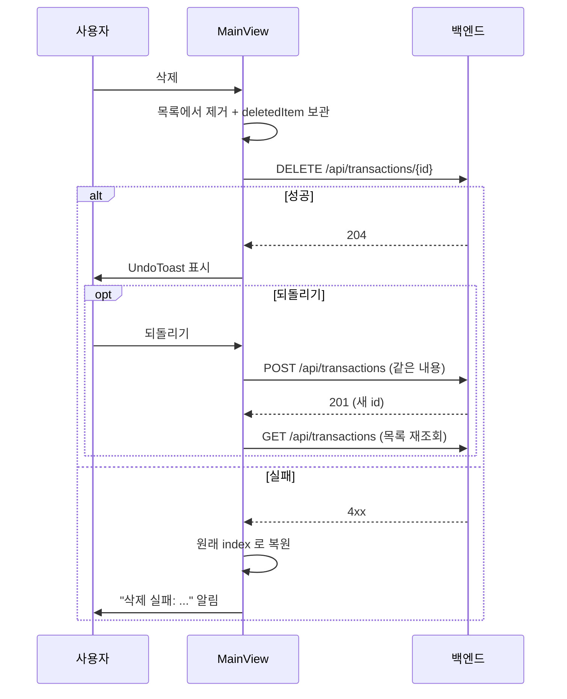

# 삭제와 되돌리기

← [그룹 가계부](README.md) · 관련 [거래 등록 흐름](flow-create-transaction.md) [결함 목록](known-issues.md)

거래 삭제는 **서버에 바로 반영**된다. 되돌리기는 취소가 아니라 **같은 내용으로 다시 만드는 것**이다.

# 흐름

1. 사용자가 항목을 왼쪽으로 끌어(스와이프/드래그) 삭제 버튼을 누른다 (`TransactionItem`의 포인터 핸들러)
2. 화면에서 즉시 사라지고 **곧바로 `DELETE`가 나간다**
3. 실패하면 원래 자리로 되돌리고 알림을 띄운다
4. 성공하면 `UndoToast`가 뜬다
5. 되돌리기를 누르면 **같은 내용으로 `POST`** 해서 다시 만들고, 목록을 새로 받아온다

# 왜 이렇게 바뀌었나

예전에는 **지연 커밋** 방식이었다 — 화면에서 먼저 지우고 4초 뒤 타이머가 실제 `DELETE`를 보냈다. 되돌리기는 그 타이머를 취소하는 것이었다. 서버 왕복 없이 되돌릴 수 있다는 게 장점이었지만, 유실 경로가 세 개 있었다.

| 경로 | 무슨 일이 났나 |
|---|---|
| **연속 삭제** | 타이머 핸들이 하나뿐이라, 4초 안에 다른 항목을 지우면 `clearTimeout`이 **이전 항목의 서버 삭제까지** 취소했다. 화면엔 둘 다 없는데 서버엔 첫 번째가 남았다 |
| **화면 이탈** | 4초 안에 탭을 닫거나 다른 화면으로 가면 타이머가 안 돌고 삭제가 유실됐다. 언마운트 시 정리도 없었다 |
| **되돌리기 경합** | 타이머 콜백이 `await deleteTransaction(id)` **뒤에** `setShowUndo(false)`를 했다. 그 왕복 시간 동안 되돌리기가 아직 눌리는 상태였고, 누르면 UI는 복원되는데 서버는 이미 삭제된 뒤였다 |

**세 경로 모두 "지연 커밋"이라는 설계에서 나왔다.** 타이머를 항목별로 쪼개거나 유예 중 추가 삭제를 막는 방법도 있었지만, 그건 첫 번째 경로만 막고 나머지 둘은 그대로 남는다.

지연 커밋을 없애니 **문제가 될 중간 상태 자체가 사라졌다.** 서버가 항상 진실이다. 타이머 상태 3개(`deleteTimer`와 관련 분기)가 통째로 없어져 코드도 짧아졌다.

> [!NOTE]
> [#7](https://github.com/s2ngK/claude-asset-man/issues/7) 에서 바꿨다.

# 알아둘 점

## 되돌리면 id 가 새로 발급된다
같은 행을 되살리는 게 아니라 새로 만드는 것이다. `id`와 `created_at`이 바뀐다.
목록·통계는 어차피 다시 조회하므로 화면에는 영향이 없다.

## 되돌려도 작성자는 그대로다
`user_id`는 서버가 호출자의 토큰에서 채운다. **자기 내역만 지울 수 있으므로**
(→ [인증과 그룹 격리](auth-and-scoping.md)) 되돌린 결과도 원래 작성자와 같다.

## 되돌리기 가능 시간은 토스트가 정한다
`UndoToast`가 자체 5초 타이머로 `onClose()`를 부른다. 그 뒤에는 되돌릴 수 없다.
예전처럼 삭제 커밋 타이밍과 얽혀 있지 않다.

## 삭제가 실패하면 원래 자리로 돌아온다
`restoreAt(item, index)`가 `splice`로 **원래 index**에 다시 넣는다. 맨 앞에 붙지 않는다.

# 스와이프 제스처

`TransactionItem`이 직접 구현한다. 라이브러리를 쓰지 않는다.

- `onPointerDown` / `onPointerMove` / `onPointerUp` / `onPointerCancel`
- **왼쪽으로만** 열린다 (`diff > 0`일 때만 `offset` 증가)
- 50px 넘게 끌면 삭제 버튼이 열린 상태(80px)로 고정, 아니면 원위치
- 오버스크롤 20px 허용

## 포인터 이벤트라 마우스로도 된다

예전에는 `onTouchStart` / `onTouchMove` / `onTouchEnd` 였다. 그래서 **데스크톱 마우스로는
삭제 수단이 아예 없었다** — 삭제 버튼은 행 아래에 깔려 있고, 그걸 드러낼 유일한 방법이
터치 제스처였다. 마우스로 행을 누르면 편집만 열렸다.

포인터 이벤트는 마우스·터치·펜을 한 코드로 받는다. 모바일 동작은 그대로 두고 데스크톱을
얻는 쪽이라, 터치 전용 핸들러를 따로 남길 이유가 없다.

같이 딸려온 것들:

| 장치 | 무엇을 해줘야 했나 |
|---|---|
| 공통 | 4px 넘게 움직여야 드래그로 친다. 클릭할 때의 손떨림이 행을 흔들지 않게 |
| 공통 | 드래그 끝에 오는 `click` 을 한 번 삼킨다 (`swallowClick`). 안 그러면 놓자마자 편집이 열린다 |
| 마우스 | `setPointerCapture` — 커서가 행 밖으로 나가도 `move`/`up` 이 계속 들어온다 |
| 터치 | `touch-action: pan-y` — 세로 스크롤은 브라우저에 넘기고 가로만 우리가 받는다 |
| 공통 | 끄는 동안 `transition-transform` 을 끈다. 켜두면 200ms 씩 뒤따라와 손에 안 붙는다 |

드래그 시작점은 state 가 아니라 `useRef` 에 둔다. state 로 두면 첫 `move` 에서 아직 반영되지
않은 시작점을 읽는다 — 터치 구현이 `touchStart` 를 state 로 들고 있어 실제로 그랬다.

> [!NOTE]
> 마우스에는 **아직 발견 가능성(discoverability) 문제가 남아 있다.** 끌 수 있다는 걸
> 알려주는 표시가 없다. 호버 시 삭제 버튼을 살짝 드러내는 식의 보완은 하지 않았다.
