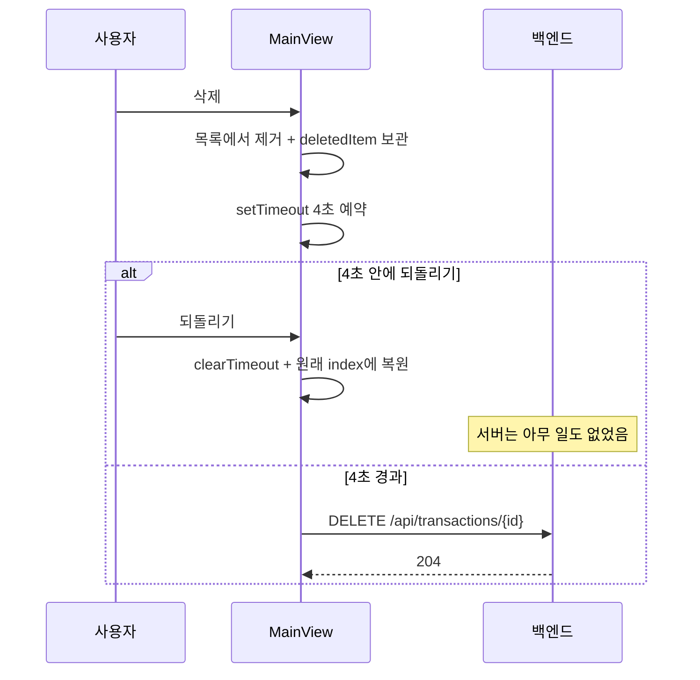

# 삭제와 되돌리기

← [그룹 가계부](README.md) · 관련 [거래 등록 흐름](flow-create-transaction.md) [결함 목록](known-issues.md)

거래 삭제는 **낙관적으로** 처리된다. 등록([거래 등록 흐름](flow-create-transaction.md))이 재조회 방식인 것과 정반대다.

# 설계 의도

1. 사용자가 항목을 왼쪽으로 스와이프해 삭제 버튼을 누른다 (`TransactionItem`의 터치 핸들러)
2. **화면에서 즉시 사라진다.** 서버 요청은 아직 안 나간다
3. `UndoToast`가 뜬다
4. **4초** 안에 되돌리기를 누르면 → 타이머 취소, 목록 원위치. 서버는 아무것도 모른다
5. 4초가 지나면 → 그때 `DELETE /api/transactions/{id}`가 나간다

되돌리기가 서버 왕복 없이 즉시 동작하는 게 이 방식의 장점이다.



# 구현 세부

`MainView`가 들고 있는 상태:

| 상태 | 역할 |
|---|---|
| `deletedItem` | `{ item, index }` — 복원할 위치까지 기억 |
| `showUndo` | 토스트 표시 여부 |
| `deleteTimer` | 예약된 `setTimeout` 핸들 **(단 하나)** |

복원은 `splice(index, 0, item)`이라 **원래 자리로** 돌아간다. 맨 앞에 붙지 않는다.

서버 삭제가 실패하면 `catch`에서 `fetchTransactions()`로 목록을 다시 받아 화면을 서버 상태에 맞춘다.

# ⚠️ 타이머가 하나뿐이라 생기는 문제

> [!CAUTION] 연속으로 지우면 먼저 지운 항목이 서버에 남는다
> `deleteTimer` 핸들이 하나뿐이라, 4초가 지나기 전에 다른 항목을 지우면
> `clearTimeout(deleteTimer)`가 **이전 항목의 서버 삭제 요청까지** 취소해 버린다.

```
t=0s   A 삭제 → 화면에서 제거, 타이머1 예약
t=1s   B 삭제 → clearTimeout(타이머1)   ← A의 서버 삭제가 취소됨
                화면에서 제거, 타이머2 예약
t=5s   타이머2 발화 → B만 서버에서 삭제

결과   화면: 둘 다 없음
       서버: A가 살아 있음 → 새로고침하면 A가 되살아난다
```

`deletedItem`도 덮어써지므로 되돌리기는 **가장 최근 것 하나만** 복원할 수 있다.

같은 이유로 **4초가 지나기 전에 탭을 닫거나 다른 화면으로 이동해도 삭제가 유실된다.** 언마운트 시 타이머를 정리하는 `useEffect` cleanup도 없다.

→ [결함 목록](known-issues.md) 결함 03

## 다행인 점
유실 방향이 "안 지워짐"이라 **데이터가 사라지지는 않는다.** 사용자 입장에선 "지웠는데 다시 나타나네?"로 보인다. 혼란스럽긴 해도 손실은 아니다.

## 고치는 방향
두 가지 중 하나다.

1. 타이머를 `id`별 `Map`으로 들고 각각 독립적으로 관리 — 현 UX를 유지
2. **낙관적 삭제를 포기한다.** 즉시 `DELETE`를 보내고, 되돌리기는 `POST`로 다시 만든다
   - 유실 경로가 아예 없어지고 코드도 단순해진다
   - 대신 되돌리기에 서버 왕복이 생기고, 새 `id`가 발급된다

# 스와이프 제스처

`TransactionItem`이 직접 구현한다. 라이브러리를 쓰지 않는다.

- `onTouchStart` / `onTouchMove` / `onTouchEnd`
- **왼쪽으로만** 스와이프가 먹는다 (`diff > 0`일 때만 `offset` 증가)
- 50px 넘게 끌면 삭제 버튼이 열린 상태(80px)로 고정, 아니면 원위치
- 오버스크롤 20px 허용

터치 이벤트 기반이라 **데스크톱 마우스로는 동작하지 않는다.** PWA·모바일 우선 설계의 결과다.
